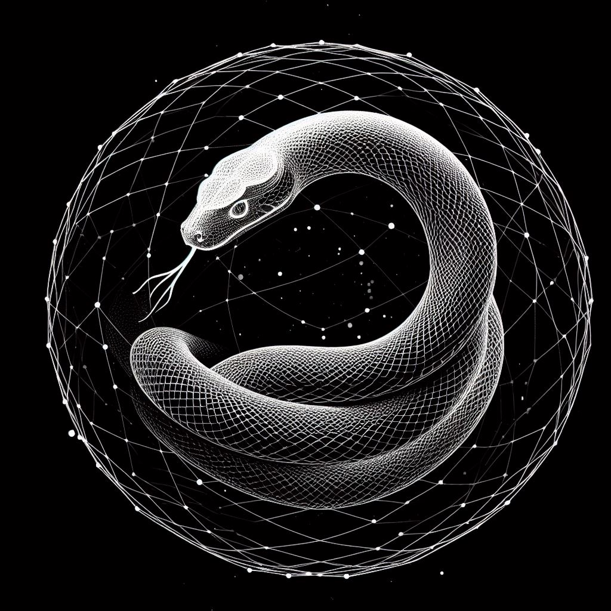

  

# OuroborosDB

A versioned, distributed key-value store designed for data integrity against bit rot. Uses CRC for added data verification. Offers seamless merging, detailed history with a chain of hashes, and an easy-to-use private-public key security mechanism. Compatible in browsers through WebAssembly (WASM) and on Linux/Docker environments.

## OuroborosDB Development TODO List (has to change)

- [ ] **WASM Networking Tests**
  - [ ] Set up the Go environment for WebAssembly compilation.
  - [ ] Create a basic WASM module in Go.
  - [ ] Implement networking tests for the WASM module.
  
- [ ] **Core Database Features**
  - [ ] Define data structures for key-value pairs and metadata.
  - [ ] Implement CRUD operations for the key-value store.
  - [ ] Integrate CRC checks for data integrity.
  - [ ] Design and implement a chain of hashes for history tracking.
  
- [ ] **Data Merging and Versioning**
  - [ ] Implement data versioning mechanisms.
  - [ ] Create functions for merging divergent datasets.
  - [ ] Add conflict resolution strategies for data merges.
  
- [ ] **Private-Public Key Security**
  - [ ] Design the encryption module.
  - [ ] Integrate a private-public key system for encryption/decryption.
  - [ ] Implement secure key storage mechanisms.
  
- [ ] **Deployment & Integration**
  - [ ] Configure Docker for Linux deployment.
  - [ ] Create a browser-friendly version using WASM.
  - [ ] Document deployment processes for both platforms.
  
- [ ] **Miscellaneous**
  - [ ] Add logging and monitoring functionalities.
  - [ ] Design a user-friendly CLI or UI.
  - [ ] Write comprehensive unit tests for all functionalities.
  - [ ] Draft detailed documentation and usage guidelines.

## Name and Logo

The name "OuroborosDB" is derived from the ancient symbol "Ouroboros," a representation of cyclical events, continuity, and endless return. Historically, it's been a potent symbol across various cultures, signifying the eternal cycle of life, death, and rebirth. In the context of this database, the Ouroboros symbolizes the perpetual preservation and renewal of data. While the traditional Ouroboros depicts a serpent consuming its tail, our version deviates, hinting at both reverence for historical cycles and the importance of continuous adaptation in the face of modern data challenges.

