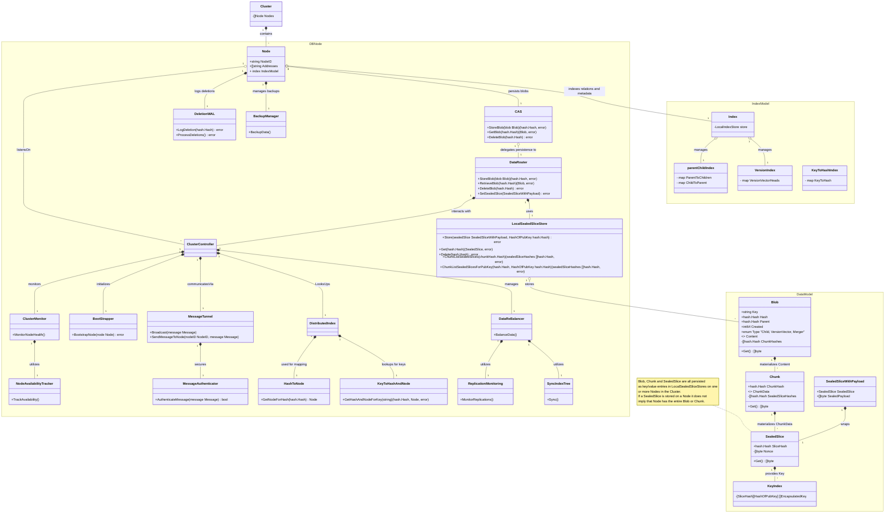

# OuroborosDB

[](https://pkg.go.dev/github.com/i5heu/ouroboros-db) [](https://github.com/i5heu/OuroborosDB/actions/workflows/go.yml)  [](https://goreportcard.com/report/github.com/i5heu/ouroboros-db) [](https://wakatime.com/badge/github/i5heu/ouroboros-db)

<p align="center" style="margin: 2em;">
  
</p>

⚠️ This Project is still in development and not ready for production use. ⚠️

- **OuroborosDB** is an in-progress **distributed, content-addressable database library** for Go. Data is addressed by hashes and organized in a **Git-like DAG of Blobs**, where each Blob can point to a `Parent` and form branches and merge nodes. Concurrent writes simply become new heads in the DAG that the caller can inspect and resolve.
- Data is stored as **Blobs → Chunks → SealedSlices**: blobs are versioned objects (Git-like DAG with parents/heads), chunks are deduplicated content blocks, and sealed slices are compressed, erasure-coded, and encrypted fragments distributed across nodes.
- The cluster is designed to be **stateless-ish and self-healing**: nodes host local KV stores, and a combination of a **SyncIndexTree** (Merkle-style sync) and a **DeletionWAL** (tombstone propagation) keeps replicas convergent without a global consensus log.
- OuroborosDB is exposed as a **single root Go package** (`import "github.com/i5heu/ouroborosdb"`) that can be embedded into other Go projects.

## Name and Logo

The name "OuroborosDB" is derived from the ancient symbol "Ouroboros," a representation of cyclical events, continuity, and endless return. Historically, it's been a potent symbol across various cultures, signifying the eternal cycle of life, death, and rebirth. In the context of this database, the Ouroboros symbolizes the perpetual preservation and renewal of data. While the traditional Ouroboros depicts a serpent consuming its tail, our version deviates, hinting at both reverence for historical cycles and the importance of continuous adaptation in the face of change.

## Development Notes

### Legend

#### Annotation legend for function comments:
To indicate the correctness and safety of the logic of functions, the following annotations are used in comments directly after the function definitions, at the same line as func (See examples below):

- `// A` - Function and was written by **AI** and was not reviewed by a **human**.
- `// AP` - Function was written by **AI** and was reviewed but the **human** has found a potential issue which the **human** marked with a `// TODO ` comment.
- `// AC` - Function was written by **AI** and was reviewed and approved by a **human** that has medium confidence in the correctness and safety of the logic.
- `// H` - Function was written by a **human**
- `// HP` - Function was written by a **human** but the **human** has found a potential issue which the **human** marked with a `// TODO ` comment.
- `// HC` - A **human** comprehended the logic of th function in all its dimensions and is confident about its correctness and safety.

If the function has a higher risk profile (e.g., involves complex algorithms, security-sensitive operations, or critical data handling), a `P` prefix is added for `Priority`:

**All `P` function must be brought to `PHC` status before a production release.**

We add the indicators directly after the function declaration, although it is normally not common practice in Go, because it makes it easier to see the status of the function for most editors as they show use sticky function declaration.

It is negotiable that AI generated functions must be generated with an `// A` or `// AP` annotation after the function declaration `func exampleFunction() { // A`.

Examples:  
```go

// This function does X, Y, and Z.
func exampleFunction() { // A
    // Function is low risk and was written by AI and not reviewed by a human.
}

// This function does X, Y, and Z.
func exampleFunction() { // HC
    // Function is low risk and was comprehended by a human who is confident about its correctness and safety.
}

// This function performs critical operations X, Y, and Z has some funky stuff going on.
func criticalFunction() { // PAP
    // Function is high risk and was comprehended by a human who is confident about its correctness and safety.
}

// This function performs critical operations X, Y, and Z.
func criticalFunction() { // PHC
    // Function is high risk and was comprehended by a human who is confident about its correctness and safety.
}

// If a function has multiline parameters, the annotation goes at the same line as func
func manyParametersFunction( // AC
    param1 string, 
    param2 int, 
    param3 []byte
) error { 
    // function has many parameters, was written by AI and reviewed and approved by a human.
    return nil
}
```

### Architecture

This UML uses pseudo classes to illustrate the main components and their relationships in OuroborosDB.



## License
ouroboros-db © 2025 Mia Heidenstedt and contributors   
SPDX-License-Identifier: AGPL-3.0  